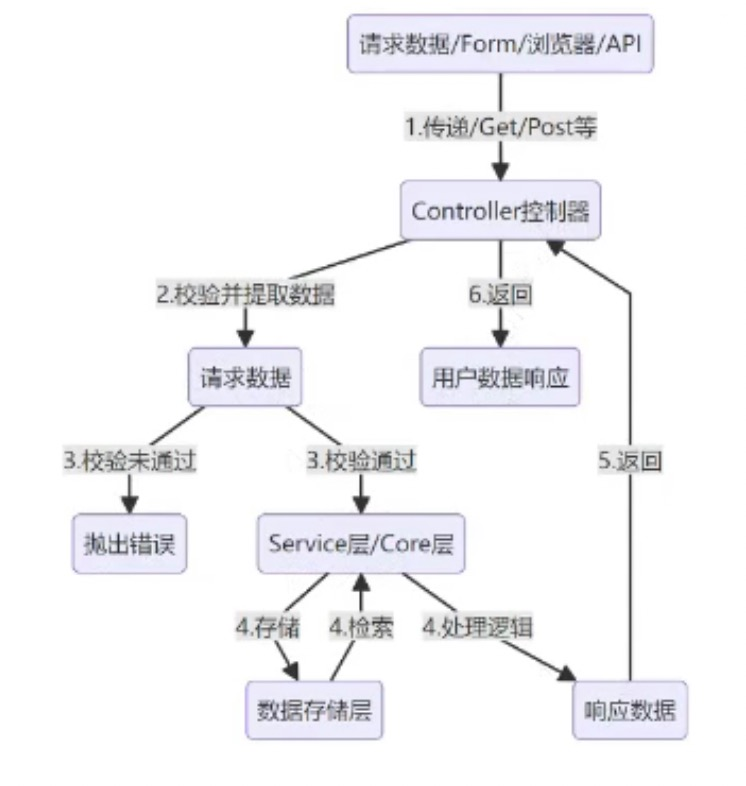

# llmops

## 系统架构


## 项目结构和规范

```shell
|---app // 应用入口集合
| ├---__init__.py
| └---http
|---config // 应用配置文件
| ├---__init__.py
| ├---config.py
| └---default_config.py
|---internal // 应用所有内部文件夹
| ├---core // LLM核心文件，集成LangChain、LLM、Embedding等非逻辑的代码
| | |---agent
| | |---chain
| | |---prompt
| | |---model_runtime
| | |---moderation
| | |---tool
| | |---vector_store
| | └---...
| ├---exception // 通用公共异常目录
| | ├---__init__.py
| | ├---exception.py
| | └---...
| ├---extension // Flask扩展文件目录
| | ├---__init__.py
| | ├---database_extension.py
| | └---...
| ├---handler // 路由处理器、控制器目录
| | ├---__init__.py
| | ├---account_handler.py
| | └---...
| ├---middleware // 应用中间件目录，包含校验是否登录
| | ├---__init__.py
| | └---middleware.py
| | └---...
| ├---migration // 数据库迁移文件目录，自动生成
| | ├---versions
| | └---...
| ├---model // 数据库模型文件目录
| | ├---__init__.py
| | ├---account.py
| | └---...
| ├---router // 应用路由文件夹
| | ├---__init__.py
| | ├---router.py
| | └---...
| ├---schedule // 调度任务、定时任务文件夹
| | ├---__init__.py
| | └---...
| ├---schema // 请求和响应的结构体
| | ├---__init__.py
| | └---...
| ├---server // 构建的应用，与app文件夹对应
| | ├---__init__.py
| | └---...
| ├---service // 服务层文件夹
| | ├---__init__.py
| | ├---oauth_service.py
| | └---...
| ├---task // 任务文件夹，支持即时任务+延迟任务
| | ├---__init__.py
| | └---...
|---pkg // 扩展包文件夹
| ├---__init__.py
| |---oauth
| | ├---__init__.py
| | ├---github_oauth.py
| | └---...
| └---... ├---storage // 本地存储文件夹
├---test // 测试目录
├---venv // 虚拟环境
├---..env // 应用配置文件
├---.gitignore // 配置git忽略文件
├---requirements.txt // 第三方包依赖管理
└---README.md // 项目说明文件
```

## 代码运行流程



## 国内代理openai的API

[API](https://yibuapi.com/)
[文档](https://apifox.com/apidoc/shared/b8f83e55-caca-4bf9-b4ff-493218bfe3fb/6191638m0)

## pytest用法

```shell
# 直接运行文件夹内符合规则的所有用例
 pytest folder_name
 
#执行某个 Python 文件中的用例
 pytest test_file.py
 
# 执行某个 Python 文件内的某个函数
 pytest test_file.py::test_func
 
# 执行某个 Python 文件内某个测试类的某个方法
 pytest test_file.py::TestClass::test_method
 
# 运行测试时显示标准输出(stdout),允许测试中的 print0) 语句直接输出到终端
 pytest -s
 
#运行测试时显示标准输出(stdout),允许测试中的 print() 语句直接输出到終端
 pytest -s
 
#运行测试时显示详细的信息,包括每个测试用例的名称及结果(通过/失败/跳过等), -v 代表 verbose
 pytest -v
```

